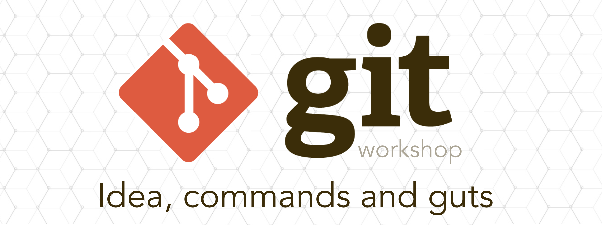

## Notatki z warsztatu

* [Core](core/README.md)
* [Remote](remote/README.md)
* [Tools](tools/README.md)
* [Internals](internals/README.md)

## Polecane materiały

* [Tech Talk: Linus Torvalds on git](https://www.youtube.com/watch?v=4XpnKHJAok8)
* [Git From the Bits Up](https://www.youtube.com/watch?v=MYP56QJpDr4)
* [GitHUB workflow (it's not the git workflow)](https://guides.github.com/introduction/flow/)
* [Podlaski Git](https://github.com/maciejkorsan/podlaskigit)
* [Pro Git](https://git-scm.com/book/en/v2)

## Podziękowania  

Dziękuje za uczestnictwo. A teraz: let's ~~go~~ git to work!

Paweł
