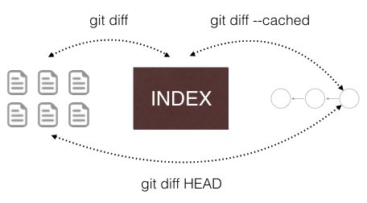
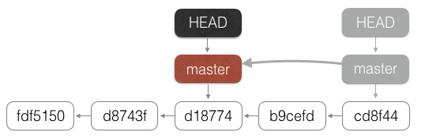
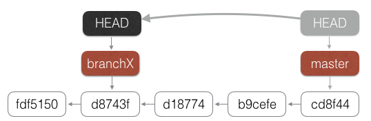
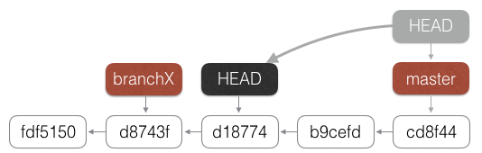
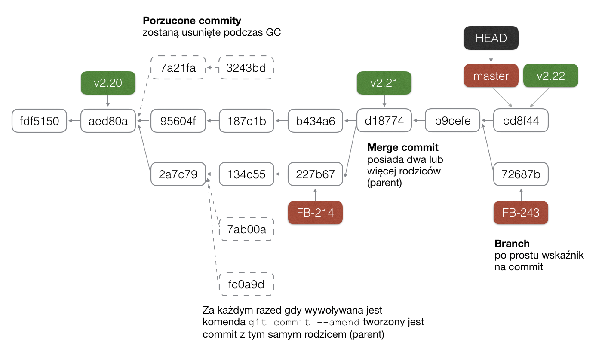

# GIT CORE

## COMMIT

#### Zadanie

Z czego składa się commit?

#### Rozwiązanie

* `git show --format=raw COMMIT`
* `git cat-file -p COMMIT`

Commit składa się z:
```
commit 01541a94517c4762392f662282efc92e66764c11
tree 3cec5d4c656e6332ccba5d3489f3c577bc2c3d4b
parent 66aaaded7bf7f38580eeef7c99d87558e9751117
author YannickMG <yannickmg@gmail.com> 1500655370 -0400
committer Joe Warren <Joezo@users.noreply.github.com> 1500655370 +0100

    Added "Interstella 5555: The 5tory of the 5ecret 5tar 5ystem" (#357)
```
* Identyfikator commita; wyliczony na bazie innych pól składowych (funkcja skrótu sha1)
* Identyfikator drzewa plików i katalogów czyli stan projektu powiązany z commitem
* Commit(y) bezpośrednio poprzedzające
* Autor zmiany i data jej powstania
* Osoba, która podpięła commit do grafu i data tej operacji
* Opis zmiany

Commit z założenia jest niemodyfikowalny i jego integralności pilnuje Id (funkcja skrótu sha1)

## LOG

Składnia `git log COMMIT`. W przypadku kiedy zostanie przekazana referencja (np. `git log BRANCH_NAME`) zostanie użyty commit, na który ta referencja wskazuje. Wywołanie `git log` wykona `git log HEAD`.

Komenda przechodzi po commitach i je wyświetla. Kolejny krok to commity wskazane przez pole `parent`.

#### Przykład

          F
         /        
    A - B - C - D
          /
        E

- `git log D` zostaną wyświetlone commity `D`, `C`, `E`, `B` i `A`. Pominięty zostanie commit `F`.
- `git log F` zostaną wyświetlone commity `F`, `B` i `A`. Pominięte zostaną `D`, `C` i `E`

#### Parametry

* `git log`
* `git log --graph`
* `git log --graph --oneline`
* `git log --graph --oneline --decorate`

#### Graficzne narzędzia
* [SourceTree](https://www.sourcetreeapp.com/)
* [gitk](https://git-scm.com/docs/gitk)
* [git gui](https://git-scm.com/download/gui/windows),
* ... i wiele, wiele innych

#### Przydatny alias

`git config --global alias.lg "log --graph --pretty=format:'%Cred%h%Creset -%C(yellow)%d%Creset %s %Cgreen(%cr) %C(bold blue)<%an>%Creset' --abbrev-commit --date=relative"`

#### Zadanie 1

* Co wydarzyło się w: `23702b3`?
* Co wydarzyło się w: `21c3d4f`?

#### Zadanie 2

Poruszanie się w sposób "relatywny"

* `~~~~` `~1`, `~99`, `~N` cofamy się o N commitów do tyłu
* `^`, `^1`, `^2` cofamy się o jeden do tyłu wybierając odpowiednie rozgałęzienie
* dozwolone `^^^` - cofamy się o 3 commity do tyłu
* a nawet `~2^^~5` lub `COMMIT~3^^`

W jaki sposób dojść z `01541a9` do `e2e7a6b`?

#### Rozwiązanie

- `git show master~2^2~4`
- lub `git lg master~2^2~4`
- lub `git lg 01541a9~2^2~4`

## DESCRIBE

Komenda `git describe COMMIT` zwraca alternatywny identyfikator commita.

Przykładowy identyfikator: `v0.8.0-200-g01541a9`. Zbudowany jest z:
* `v0.8.0` najbliższy tag
* `200` liczba commitów od tag'a do wskazanego commita
* separator `g` (bo nie jest częścią zapisu szesnastkowego hash'a)
* `01541a9` oryginalny identyfikator commita

Alternatywny identyfikator może być używać wszędzie tam gdzie potrzebujemy wskazać commit (`git log v0.8.0-200-g01541a9`, `git show v0.8.0-200-g01541a9`, ...).

#### Zadanie

W jakim celu powstało to narzędzie? Podpowiedź: "ponieważ SVN..."

#### Rozwiązanie

W SVN identyfikator commita to liczba, która wraz z kolejnymi zmianami rośnie. Pozwala to ocenić jak wypada nasz commit w relacji do innych. Przykładowo mając commit `1120` wiemy, że jest on znacząco oddalony od tego z numerem `1232`.

W Git identyfikator commita to hash. Jedyne stałe punkty odniesienia to tagi. Komenda `git describe` pozwala wygenerować alternatywny identyfikator, który pomaga nam określić odległość od najbliższego taga. Dzięki temu mamy świadomość jak opisywany commit wypada na tle historii zmian.

## DIFF (porównywanie commitów)

#### Zadanie

    Log: A - B - (1, 100 lub 1000 commitów pomiędzy) - X - Z

Wywołujemy `git diff A..Z`. Czy jest różnica w czasie wykonania polecenia jeżeli pomiędzy porównywanymi commitami jest a) jeden b) sto c) tysiąc commitów? Jeżeli TAK to jak duża?

#### Rozwiązanie

Git przechowuje całe snapshoty stanów projektów (czyli katalogi + pliki). Komenda  `git diff A..Z` sprawdza bezpośrendio stan projektu `A`, stan projektu `Z` i wylicza różnice. Git nie zagląda do commitów pomiędzy `A` i `Z`.

Alternatywne narzędzie SVN przechodzi po wszystkich zmianach od punktu `A` do `Z`, Zbiera globalną różnice i wyświetla ją. Im większa odległość między `A` i `Z` tym operacja trwa dłużej.

## INDEX

Przechowuje informacje o statnie projektu (a dokładnie o zawartości wszystkich plików w projekcie). Za pomocą komend `git add ...`, `git mv ...`, `git rm ...` modyfikujemy ten stan. Komenda `git commit ...` utrwala go w postaci commit'a i obiektach, powiązanych z nim.

    WORKING DIRECTORY <=> INDEX <=> COMMIT

#### Nazewnictwo

W uproszczeniu: index == cached == staging

Junio C Hamano (http://git.661346.n2.nabble.com/Consistent-terminology-cached-staged-index-td6021438.html)

> "cache" was an old name (and still established name in-use in the code) for the index.  Some commands make sense to affect both the index and the working tree (e.g. "apply") and you give --index to mean "both index and the working tree" while some other operating modes that make sense only to look at the index, ignoring the potential difference between the working tree and the index (e.g. again "apply"), taking only the cached changes into account, are invoked with --cached to mean "look only at what is recorded in the index" ...
>
>    ...My feeling is that "to stage" is primarily used, outside "git" circle, as a logistics term.  If you find it easier to visualize the concept of the index with "staging area" ("an area where troops and equipment in transit are assembled before a military operation", you may find it easier to say "stage this path ('git add path')", instead of "adding to the set of contents..."

#### Zawartość indeksu

Podejrzenie zawartości indeksu: `git ls-files -s`

Przechowujemy informacje o "śledzonych" plikach.

    100644 c2658d7d1b31848c3b71960543cb0368e56cd4c7 0	.gitignore
    100644 1a5460859828560e36fdd73a0fbb5f5234cb33be 0	.jshintrc
    100644 ee920b38161a0e1a79cf67098df9a60e4c18aadc 0	.npmignore
    100644 2d06559e9ff6d25bbba9ea4e59e4b5bf2f827506 0	.travis.yml
    100644 bbfea6b390176f20618631e235933811adc1bf23 0	LICENSE
    100644 addc66f6ef17881921f99370fac766b9ae03e111 0	README.md
    100755 90507e668727e47003f10b2ba9cbb8d54976de86 0	five.js
    100644 977ca7b3a34747f774eb8ae01c20dc2668319d1a 0	index.js
    100644 6e6c5505eb5d39108105af541e9d88c885fa9fde 0	logo.svg
    100644 0209c10d29b15c8ffdd933ad4eec29bcef5b8d51 0	package.json
    100755 63ee6cc81303e52707bf6e3529b7f83639656ffa 0	test.js

Każdy wpis w indeksie zawiera ścieżkę do śledzonego pliku i identyfikator jego zawartości. Koncepcyjnie indeks jest zoptymalizowany pod "content". Z tego powodu nie ma możliwości przechowywania informacji o pustych katalogach.

#### Ciekawostka

Historycznie `git add` tylko dodawał plik do indeksu. Do aktualizacji służyła komenda `git update-index`. W 2007 w celu uproszczenia API zdecydowano że `git add` będzie dodawać i aktualizować pliki w indeksie.

#### Zadanie 1

Usuń plik `.git/index`. Z perspektywy git'a indeks jest pusty. Co pokaże komenda `git status`?

#### Rozwiązanie

Git status pokazuje:

* __na zielono__ różnica między HEAD a staging area
* __na czerowno__ różnice między staging area a working tree
* __untracked files__ czyli pliki których brakuje w indeksie

Zobaczymy:

* na zielono - wszystkie pliki projektu
* untracked files - wszystkie pliki projektu

#### Zadanie 2

W jaki sposób szybko przywrócić indeks do poprzedniego stanu?

#### Rozwiązanie

Wystarczy na nowo dodać wszystkie pliki do indeksu, czyli wywołać `git add .`

## DIFF (status prac)

* `git diff` - porównuje wersje `working directory` z `index`
* `git diff --cached` lub `git diff --staged` porównuje wersje `index` z tym co jest w commit wskazywanym przez HEAD
* `git diff HEAD` porównuje wersje `working directory` z tym co jest w commit wskazywanym przez HEAD z pominięciem indeksu



## STATUS

Komenda `git status` pokazuje w uproszczony sposób różnicę między:
* na czerwono: working directory a indeksem, czyli `git diff`
* na zielono: indeksem a commitem, czyli `git diff --cached`

## RESET

Branch to tylko wskaźnik (pointer, referencja) na commita.

Komenda `git reset --strategia NOWY_COMMIT_HASH` przesuwa aktualny branch na wskazany commit.

Strategie:

* `git reset --hard COMMIT` przełącza: working directory (), index (), branch ()
* `git reset --soft COMMIT` przełącza: branch ()
* `git reset --mixed COMMIT` przełącza: index (), branch ()

Przydatne podejście relatywne (przedostatni commit HEAD~, dwa commity do tyłu HEAD~2).

* `git reset --hard HEAD~2` przełącz aktualny branch na dwie zmiany wstecz



#### Zadanie 1

Start: `git clean -fd && git checkout master && git reset --hard 01541a9`

Jak z dwóch ostatnich commitów zrobić jeden, korzystając tylko z `git reset` i `git commit`?

#### Rozwiązanie

Na początku sprawdźmy dwa ostatnie commity:

* Wylistowanie commitów: `git log --graph HEAD~2..HEAD`
* Jakich zmian się spodziewamy: `git diff HEAD~2..HEAD`
* W przypadku większych zmian przydatne: `git diff HEAD~2..HEAD --name-only`
* Odwrotne zmiany: `git diff HEAD..HEAD~2`

Działamy:

1. `git reset --soft HEAD~2`
2. `git commit -m "some changes"`

#### Zadanie 2

Start: `git clean -fd && git checkout master && git reset --hard origin/master`

W jaki sposób uzyskać zmiany odwrotne do __01541a9__ bez użycia `git revert` ale z użyciem `git reset` i `git commit`?

#### Rozwiązanie

1. `git reset --hard HEAD~`
2. `git reset --soft 01541a9`
3. `git commit -m "Revert Interstella 5555 changes"`

## MOVE

`git mv file-path new-file-path`

Git bazuje na stanie projektu (katalogi i zawartość plików). Nie ma możliwości przechowania informacji, że coś zostało usunięte / zmieniła się nazwa / lub katalog. Ta informacja jest wyliczana podczas porównywania stanów przed i po. Można sterować tym jak bardzo pliki powinny być podobne do siebie aby zostały zaklasyfikowane jako kopia/przeniesienie.

- `git diff --find-renames=60%` - jeżeli plik usunięty jest przynajmniej w 60% taki sam jak plik dodany Git wyświetli je jako zmiana nazwy

Dodatkowo przydatne przełączniki:

- `git diff --find-copies`
- `git diff --find-copies-harder`

> By default, -C only finds copies when the source file was also
modified in the same commit. Since you did not modify hello.txt in the
same commit where you copied it to copied.txt, it will not be
considered.
> If you pass -C -C (twice), or use --find-copies-harder, Git will
consider all files in the repository. Note that this can be slower,
which is the reason why it's not the default.
> The documentation for git diff describes the -C (--find-copies) and
--find-copies-harder flags and their limitations.

https://marc.info/?l=git&m=141730942428974&w=2

## BRANCH

Branch to tylko wskaźnik na commita

Lista branchy

* `git branch` tylko lokalne
* `git branch -vv` lokalne + dodatkowe informacje o powiązanych po stronie remote branchach
* `git branch -rvv` tylko zdalne
* `git branch -avv` wszystkie

Tworzenie nowego brancha

* `git branch NAZWA` utworzy branch NAZWA wskazujący na aktualnie przełączonego commit'a (na to co w sposób pośredni lub bezpośredni wskazuje HEAD)
* `git branch NAZWA COMMIT` utworzy branch NAZWA wskazujący na COMMIT
* Przykładowo `git branch DPA-1 ad3s131s`

Przejście na istniejącego już brancha

* `git checkout NAZWA`
* `git checkout branchX`



Przełączenie się bezpośrednio na commit (tzw. __detached head__)

* `git checkout COMMIT`
* `git checkout d18774`



Stworzenie brancha'a NAZWA wskazującego na COMMIT i __przełączenie się na niego__

* `git checkout -b NAZWA COMMIT`

Usunięcie brancha

* `git branch -D NAZWA`

#### Przywracanie zawartości plików

`git checkout` ma jeszcze jedno ciekawe zastosowanie. Wszystko co ma na końcu `-- plik` lub `-- pattern` wskazuje git'owi, że ma wykonać daną operacje tylko na danym(ych) plikach.

Przykładowo:

* `git checkout HEAD~100 -- README.md` przywraca README.md z wersji 100 commitów temu
* `git checkout HEAD~1 -- src/*` przywraca cały katalog src z wersji jeden commit temu

## MERGE

#### Strategie

* __fast forward__ - przesuwa wskaźnik branch'a do przodu
  * możliwy tylko wtedy gdy zmiany bezpośrednio następują po wskazanym miejscu
  * najszybszy sposób mergowania
* __recursive__ - łączy dwa rozgałęzienia
  * wykorzystuje algorytm [Three-way merge](https://en.wikipedia.org/wiki/Merge_(version_control))
  * bazuje na wspólnym poprzedniku `git merge-base branchX master`
* __ours__/__theirs__
* __octopus__ - wykorzystywany gdy mergujemy trzy lub więcej branchy
  * Przykład: http://git.cutebit.de/img/octomerge.png
  * [ciekawostka] dyskusja o ocotmerge (66 parents) w kernelu linuxa, który "popsuł" narzędzie gitk: https://www.destroyallsoftware.com/blog/2017/the-biggest-and-weirdest-commits-in-linux-kernel-git-history. Do dyskusji włączyć się Linus Torvalds _"Christ, that's not an octopus, that's a Cthulhu merge"_.
* subtree - mergujemy oddzielny projekt do naszego brancha jako podkatalog.
  * `git merge --squash -Xsubtree=rack --no-commit rack_branch`
* własny (można napisać)

Strategie: __ours__/__theris__/__octopus__ wspierają merge trzech lub więcej branchy na raz.

#### Porównywanie plików

* Domyślnie do porównywania plików wykorzystywany jest algorytm LCS (Longest Common Subsequence).
* Przełącznik `--patience` - bardziej zaawansowany sposób wykrywania różnic. Skupia się na unikalnych liniach i traktuje je jako punkty odniesienia. Warto o tym przełączniku pamiętać gdy widzimy, że domyślny algorytm połączył kilka zmian w niezrozumiały dla nas sposób. Opcja ta jest dostępna również przy `git rebase -s patience` i `git diff --patience A..B`   

Więcej informacji:

- https://medium.com/@mxtnr/git-tip-1-use-git-diff-patience-bf3f71ec87f1
- https://git-scm.com/docs/git-merge#git-merge-patience
- `git merge --strategy-option=patience`
- `git merge -X patience`
- `git config --global diff.algorithm patience`

Przykład z projektu:

* Skrypt szukający różnic w diff'ach: [scripts/diff-comparator](scripts/diff-comparator)
* `git diff e5856b8..133a777 -- five.js` vs `git diff --patience e5856b8..133a777 -- five.js`

#### Teoria Three way merged

https://en.wikipedia.org/wiki/Merge_(version_control)
https://en.wikipedia.org/wiki/File:Criss-cross-merge-fix.svg

#### Zadanie (przygotowanie pod rebase)

1. Utwórz branch `new_readme`, który wskazuje na commit `5ad00a7`. Przełącz się na ten branch.
2. Zmodyfikuj plik `README.md`.
3. Utwórz nowy commit z tej zmiany.
4. Wróc do brancha `master`.
5. Zrób merge brancha `new_readme` do `master`.

#### Rozwiązanie

1. `git clean -fd && git reset --hard cb6586b1`
2. `git checkout -b new_readme 5251e453`
3. `echo "aaaa" >> README.md`
4. `git add -A`
5. `git commit -m "DPA changes in README.md"`
6. `git checkout master`
7. `git merge new_readme`

Widziemy, że przez znaczącą część logu zmian idzie linia łącząca nowy commit z brancha `new_readme` z ostatnim commitem z brancha `master`. Linia ta zazwyczaj wynika tylko i wyłącznie z tego, że w trakcie rozwijania naszego brancha do `master` doszły nowe zmiany.

Kilka tego typu branchy i nasz log wygląda następująco:


    * | | | | |   2471780 - Merge pull request #281
    |\ \ \ \ \ \
    | * \ \ \ \ \   1e25236 - Merge branch 'master'
    | |\ \ \ \ \ \
    | |/ / / / / /
    |/| | | | | |
    * | | | | | |   36f488e - Merge pull request #309
    |\ \ \ \ \ \ \
    | * | | | | | | 5ff0388 - reorder (2 years, 4 months ago) <structuresound>
    | * | | | | | | e5b257f - readme (2 years, 4 months ago) <structuresound>
    | * | | | | | | 72e2c2a - add Phive (2 years, 4 months ago) <structuresound>
    * | | | | | | |   84e816f - Merge pull request #268
    |\ \ \ \ \ \ \ \
    | * | | | | | | | bb147a3 - Added Furious Five
    | | | | | |/ / /
    | |/| | | | | |

Pomimo tego, że nasza zmiana została zamknięta w pojedyńczym commit to i tak git stworzył dodatkowy commit mergujący. Czy można inaczej?

## REBASE

#### Zadanie zróbmy to inaczej

- W jaki sposób cofnać zmiany z rodziału MERGE?
- Za pomocą `git rebase` ponownie wprowdź zmiany z branch `new_readme` do `master`

#### Rozwiązanie

1. Na branchu `master` należy wykonać `git reset --hard HEAD~1` (przywracanie `master` do wersji z przed `git merge new_readme`)
2. `git checkout new_readme`
3. `git rebase master`
4. `git checkout master`
5. `git merge new_readme`

Dokumentacja git-rebase: https://git-scm.com/docs/git-rebase - co się dzieje z "poprzednimi" commitami?

## REBASE interaktywny

#### Zadanie 1

Sprawdź co się stało między: `d612e38` a `6ef3b3c`. Kilka podobnych zmian w podobnym czasie.

* Połącz commity, które aktualizują plik `five.js` w jeden commit.
* Połącz commity, które aktualizują plik `test.js` w jeden commit.
* Ostatnim (najnowszym) commitem powinna być aktualizacja dokumentacji w pliku `README.md`

Uwaga: całość można zrobić bez tworzenia i przełączania się na branche. Pracujemy w tzw. `detached` mode.

1. `git checkout 6ef3b3c`
2. `git rebase -i d612e38`

#### Rozwiązanie

    # five.js
    pick 3c3a7fd Update five.js
    f 2ccab8c Update five.js
    f 674171e Update five.js
    # test.js
    pick 6463334 Update test.js
    f cbdd11f fix tests
    fk 6ef3b3c Update test.js
    # README.md
    pick bda38c9 Update README.md

#### Zadanie 2

Przejrzymy zmiany w utworzonych przez nas (za pomocą `git rebase -i`) commitach. `git diff HEAD~3..HEAD` lub `git diff d612e38..HEAD`.

Wszystkie trzy commity dotyczą tego samego - dodajemy pięć w języku `sinhala` do naszego projektu. Z perspektywy zmiany nie ma znaczenia, w którym pliku to robimy. Nie ma sensu posiadać testów gdy nie ma funkcjonalności. Funkcjonalność bez testów to również kiepska sprawa. Aktualizacja README.md jest ściśle powiazana z dodaniem języka sinhala. To powinien być __pojedyńczy commit__, który dodaje nowy język do naszego projektu.

Za pomocą `git rebase -i` połącz w jeden commit wspomniane zmiany. Nazwij commit `New sinhala language`

#### Rozwiązanie

1. `git checkout 6ef3b3c`
2. `git rebase -i d612e38`


    r 3c3a7fd Update five.js
    f 6463334 Update test.js
    f 2ccab8c Update five.js
    f cbdd11f fix tests
    f bda38c9 Update README.md
    f 674171e Update five.js
    f 6ef3b3c Update test.js

#### Dyskusja

https://www.atlassian.com/git/tutorials/merging-vs-rebasing. Jakie są zalety i wady poszczególnych podejść?

## CHERRY-PICK

## Teoria

Czy można cherry-pick'ować commit mergujący?

> The way a cherry-pick works is by taking the diff a changeset represents (the difference between the working tree at that point and the working tree of its parent), and applying it to your current branch.
>
> So, if a commit has two or more parents, it also represents two or more diffs - which one should be applied?
>
> You're trying to cherry pick fd9f578, which was a merge with two parents. So you need to tell the cherry-pick command which one against which the diff should be calculated, by using the -m option. For example, git cherry-pick -m 1 fd9f578 to use parent 1 as the base.

#### Zadanie

Załóż branch `feature/clock-v2` wskazującego na commit `457f6b9`. Za pomocą `git cherry-pick bfcde98` skopiuj zmianę do swojego brancha.

* Kto jest autorem commita?
* Kto jest commiterem commita?
* Kiedy commit powstał?
* Kiedy commit został dodany do grafu?

#### Rozwiązanie

* `git checkout -b feature/clock-v2 457f6b9`
* `git cherry-pick 693fa769`
* `git show --format=raw HEAD`

#### Kilka zmian

Komenda `cherry-pick` umożliwia pobieranie kilku commitów. Przykładowo:

* `git cherry-pick d10429e8 5c84d311 3710487b 1565b18e`
* `git cherry-pick d10429e8~1..1565b18e`

## CONFLICTS (cherry-pick, rebase)

#### Zadanie 1

W jaki sytuacjach __cherry-pick__ wykryje konflikt?

#### Rozwiązanie

Wykorzytywany jest algorytm three way merge. Zamiast wspólnego poprzednika używany jest bezpośredni poprzednik przenoszonego commita.

#### Zadanie 2

W jakich sytuacjach __rebase__ wykryje konflikt?

#### Rozwiązanie

Git rebase jest tylko "aliasem" na wykonanie kilku cherry-pick'ów. Przy przenoszeniu poszczególnych commitów pojawią się konflikty w tych samych okolicznościach co w przypadku cherry-picka.

## CONFIG

Dwa poziomy local i global.

* `git config --list`
* `git config --list --global`
* `git config --list --local`
* `git config --edit --global`
* `git config --edit --local`

Konfiguracja jest przechowywana w następujących plikach:

* globalna: `~/.gitconfig`
* lokalna (per project): `.git/config`

#### Domyślny edytor

- `git config --global core.editor nano`
- `git config --global core.editor vim`

#### alias

- `git config --global alias.lg "log --graph --pretty=format:'%Cred%h%Creset -%C(yellow)%d%Creset %s %Cgreen(%cr) %C(bold blue)<%an>%Creset' --abbrev-commit --date=relative"`

## IGNORE

* __PRIVATE GLOBAL__ konfigurowalny przez `git config --global core.excludesfile /Users/pawel.warczynski/.gitignore_global`
* __PROJECT__ .gitignore
* __PRIVATE IN PROJECT__ .git/info/exclude - działa tylko dla nowo dodanych plików (nie uwzględnia tych które już są w indeksie)

## REFLOG

Komenda `git reflog` lub `git log -g`. Wyświetla listę commitów, na które nasz branch lub HEAD wskazywał. Umożliwia znalezienie osieroconych commitów, które były przez nas wykorzystywane.

* `git reflog master`
* `git reflog` lub `git reflog HEAD`

Aby cofnąć się do poprzedniego stanu na branchu master wystarczy wywołać: `git reset --hard master@{1}`

## DIRECTED ACYCLIC GRAPH


